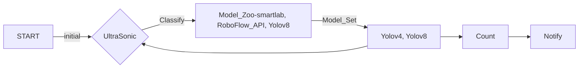

# raspberrypi_project 藥罐取放追蹤系統


https://github.com/user-attachments/assets/f5ad07ce-38d7-4b7d-b3a3-2c4d06df2b5f


https://github.com/dslee21314/raspberrypi_project/blob/main/demo.mov

Or download to see the video.


##  專案簡述
使用Raspberry Pi 4B，連接PiCam相機、US-100超音波測距儀與Intel Neural Compute Stick 2，製作一個由超音波做為櫃子門開關檢測、由相機追蹤櫃子內的藥罐，經過圖像比對與路徑追蹤，判斷藥罐有無被取用，配合軟體製作排程提示，達成藥物取用的管控機制。
## 專案發想
因為年邁父母需要按時服藥，但老人的習慣是一次購買大容量藥罐與慢性處方箋取得的大量藥盒，囤放在櫃子中。有些藥品是三餐飯後服用、有些營養品僅早上或晚上一次，管理困難。市面上是有販售分裝式每日藥盒

或智慧藥盒

但老人家不喜歡分裝，也不希望需要太多設定或與手機高度綁定的商品。
綜合考量，在不影響日常作息太多的條件，決定選擇使用視覺辨識作為主要技術
## 專案架構


## 硬體配置
本專案使用零件清單：
1. 樹莓派Raspberry Pi 4B  x1
2. NCS2運算加速棒  x1
3. US-100 超音波測距儀  x1
4. Raspberry Pi Camera  x1
5. 彩虹杜邦線   x4


### 辨識模型
在辨識模型有三種選擇：
 * Intel OpenVINO  
 Model Zoo中有個可以檢測實驗室桌面的物品[smartlab-object-detection-0004](https://www.google.com/url?sa=t&rct=j&q=&esrc=s&source=web&cd=&cad=rja&uact=8&ved=2ahUKEwjTr-_Mq-aKAxU2c_UHHSZbLwAQFnoECBgQAQ&url=https%3A%2F%2Fgithub.com%2Fopenvinotoolkit%2Fopen_model_zoo%2Fblob%2Fmaster%2Fmodels%2Fintel%2Fsmartlab-object-detection-0004%2FREADME.md&usg=AOvVaw1S4zP5KnJIenu3J_mSI8ax&opi=89978449)
可以成功在課堂初始環境執行；但後續追加物件追蹤需要更新的OpenCV，無法在這版本兼容。
 * RoboFlowAPI  
RoboFlow是一個各種AI預訓練資料集與模型的分享平台，其中有找到訓練好的[藥罐追蹤器](https://universe.roboflow.com/gary-ofgwc/medicine-jar)
RoboFlow註冊後提供以API連線執行辨識。
 * Yolov8  
RoboFlow也提供下載標註好的資料集供本地端進行訓練與部署
用Yolov8可以一次完成追蹤與識別
 * X Teachable Machine  
本專案需要辨識多個標籤在同一張圖中，無法使用Teachable Machine進行多標籤識別。

### 追蹤模型
而在追蹤模型中，有兩種選擇：
 * OpenCV
需要安裝到OpenCV 3.0 以上，同時需要搭配安裝opencv-contrib-python套件。
 * Yolov8
目前整合比較好的yolov8直接可以使用物件追蹤，配合前述的識別，一站式完成。

在原生專案的image中是以RoboFlow辨識 + OpenCV追蹤實現功能連接，但因為實體Demo前弄壞了環境，只能靜態展示功能。
後續重灌Raspberry Pi系統後，則是以Yolov8一站到底。

### 計數機制
這邊單純使用OpenCV圖像判斷，當識別物體的邊框觸及視野邊緣，之後辨識消失就將物件的取用次數增加。

### 通知系統
目前僅在CLI中印出個別標籤計數，仿照同學的機制可以改串Line Notification或email通知。

## 感應器使用
### US-100超音波測距
新款的US-100超音波測距模組支援rx-tx字串驅動和傳統的trigger-echo自行計算測距。
查詢了[參考文件](https://atceiling.blogspot.com/2014/03/raspberry-pi_18.html)
將模組後方的jumper拔除，即使用trigger-echo機制
使用以下的腳本計算距離，判斷櫃門是否打開
```python
import RPi.GPIO as GPIO
import time

trigger_pin = 23
echo_pin = 24

GPIO.setwarnings(False)
GPIO.setmode(GPIO.BCM)
GPIO.setup(trigger_pin, GPIO.OUT)
GPIO.setup(echo_pin, GPIO.IN)

def send_trigger_pulse():
    GPIO.output(trigger_pin, True)
    time.sleep(0.01)
    GPIO.output(trigger_pin, False)
    
def wait_for_echo(value, timeout):
    count = timeout
    while GPIO.input(echo_pin) != value and count > 0:
        count -= 1

def get_distance():
    send_trigger_pulse()
    wait_for_echo(True, 5000)
    start = time.time()
    wait_for_echo(False, 5000)
    finish = time.time()
    pulse_len = finish - start
    distance_cm = pulse_len * 340 * 100 / 2
    return distance_cm

while True:
    dist = get_distance()
    #print(f"{GPIO.input(echo_pin)}")
    print(f"d: {dist}")
    time.sleep(1)
```

其中表示每秒測一次距離。

## Yolov8訓練與部署
參考[Ultralytics](https://github.com/ultralytics/ultralytics)安裝套件
從RoboFlow下載訓練集，執行以下的程式碼訓練與驗證模型
```python
model = YOLO("yolov8n.pt")  # load yolo8n
# train
results = model.train(data="./jars/yolov8/data.yaml", epochs=3)
# validify
results = model.val(data="./jars/yolov8/data.yaml")
```
然後輸出模型
```python
# Export the model
model.export(format="openvino")
```
也可以直接用預測函式產出預測結果
```python
# Export the model
results = model.predict(source="./jars/yolov8/test/images/IMG_9986_jpg.rf.f24d9b899fb9e8318a0e08eba8651e28.jpg",save=True)
```

##  追蹤機制
門關上時會將最後一張圖片存成靜態，再下次開門時預先讀取。
產生出藥罐的初始位置。
其中yolo回傳的結果中，座標資訊不是常見的float。

要使用跟回傳結果隔式一樣的torch.tensor進行距離運算，才能比對到基本位置的藥罐
```python
def replace_nearest_point(point_list, new_point):
  min_distance = torch.tensor(float('inf'))
  min_index = -1

  for i, point in enumerate(point_list):
      distance = torch.sqrt((point[0] - new_point[0])**2 + (point[1] - new_point[1])**2)
      if distance < min_distance:
          min_distance = distance
          min_index = i

  if min_index != -1:
      new_point_list = point_list[:] 
      new_point_list[min_index] = new_point
      return new_point_list, min_index
  else:
      return point_list, min_index

bottles=[]

results = model.predict(source="/content/drive/MyDrive/jars/yolov8/test/images/image.png", save=True)
for result in results:
  boxes = result.boxes
  for box in boxes:
    if box.cls == 39:
      x_center = (box.xyxy[0][0] + box.xyxy[0][2]) / 2
      y_center = (box.xyxy[0][1] + box.xyxy[0][3]) / 2
      bottles.append([x_center, y_center])
```

##  計數機制
再來在開門時擷取每幀影像，與初始時的瓶罐進行比對追蹤。
如果瓶罐邊角移至畫面邊緣，則計數增加。
其中使用了opencv的繪製圖框與添加字樣，
若是要配合輸出，可以做成function回傳結果。
```python
  ret, frame = cap.read()

  if ret:
    results = model.predict(source=frame, conf=0.5)

    annotated_frame = results[0].plot()

    for result in results:
      boxes = result.boxes
      for box in boxes:
        if box.cls == 39:    # 模型辨識到bottle的id為39
          x_center = (box.xyxy[0][0] + box.xyxy[0][2]) / 2
          y_center = (box.xyxy[0][1] + box.xyxy[0][3]) / 2
          bottles, i = replace_nearest_point(bottles, [x_center, y_center])
          edge_flag = box.xyxy[0][0] == torch.tensor(0.) or box.xyxy[0][2] == torch.tensor(1024.) or box.xyxy[0][1] == torch.tensor(0.) or box.xyxy[0][3] == torch.tensor(768.)
          # 物件觸及邊緣
          if edge_flag:    # 目前用hard code寫死，辨識三個藥罐
            if i == 0:
              bottle1_cnt += 1
            elif i == 1:
              bottle2_cnt += 1
            elif i == 2:
              bottle3_cnt += 1
            print(f"[{bottle1_cnt}, {bottle2_cnt}, {bottle3_cnt}]")
      cv2.putText(annotated_frame, f"Bottle1: {bottle1_cnt}, Bottle2: {bottle2_cnt}, Bottle3: {bottle3_cnt}", (10, 30), cv2.FONT_HERSHEY_SIMPLEX, 1, (0, 255, 0), 2)
    out.write(annotated_frame)
  else:
    break
```


## 專案感想
前期利用基本環境，執行相當順利。
還有餘裕去分享影像辨識資源給同學。
但就在前幾天，為了將numpy升級到yolov8進行額外的物件追蹤測試，
誤動作將整個環境弄爆了，且備份映像檔並沒有安裝對應套件。
導致實體demo只能做兩三個單功能的靜態展示，整個開天窗。
這件事充分展現老師所提示的備份的重要；和業界常說的"如果東西正常，就不要去動他"
之後重整了環境，也將API做遠端影像識別的方式改成本地預訓練的模型。


## 參考資料
[Ultralytics-github](https://github.com/ultralytics/ultralytics)
[openvino_toolkit_model_zoo](https://github.com/openvinotoolkit/open_model_zoo)
[OpenCV 3 Tracking API目标跟踪学习笔记——定义、物体跟踪常用算法、demo](https://blog.csdn.net/shujian_tianya/article/details/84558033)
[Object Tracking using OpenCV (C++/Python)](https://learnopencv.com/object-tracking-using-opencv-cpp-python/#opencv-tracking-api)
[Roboflow_Universe](https://universe.roboflow.com/)
[Raspberry Pi 筆記(15)：超音波測距離](https://atceiling.blogspot.com/2014/03/raspberry-pi_18.html)
還有其他無數stackoverflow、CSDN與各論壇的幫助
