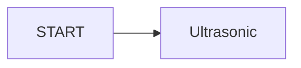

# raspberrypi_project 藥罐取放追蹤系統
##  專案簡述
使用Raspberry Pi 4B，連接PiCam相機、US-100超音波測距儀與Intel Neural Compute Stick 2，製作一個由超音波做為櫃子門開關檢測、由相機追蹤櫃子內的藥罐，經過圖像比對與路徑追蹤，判斷藥罐有無被取用，配合軟體製作排程提示，達成藥物取用的管控機制。
## 專案發想
因為年邁父母需要按時服藥，但老人的習慣是一次購買大容量藥罐與慢性處方箋取得的大量藥盒，囤放在櫃子中。有些藥品是三餐飯後服用、有些營養品僅早上或晚上一次，管理困難。市面上是有販售分裝式每日藥盒

或智慧藥盒

但老人家不喜歡分裝，也不希望需要太多設定或與手機高度綁定的商品。
綜合考量，在不影響日常作息太多的條件，決定選擇使用視覺辨識作為主要技術
## 專案架構

