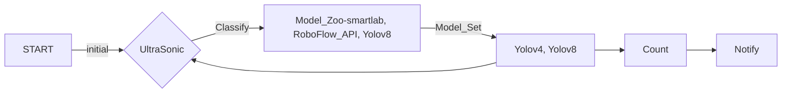

# raspberrypi_project 藥罐取放追蹤系統

[Demo](https://github.com/dslee21314/raspberrypi_project/blob/main/result_count.mov)

##  專案簡述
使用Raspberry Pi 4B，連接PiCam相機、US-100超音波測距儀與Intel Neural Compute Stick 2，製作一個由超音波做為櫃子門開關檢測、由相機追蹤櫃子內的藥罐，經過圖像比對與路徑追蹤，判斷藥罐有無被取用，配合軟體製作排程提示，達成藥物取用的管控機制。
## 專案發想
因為年邁父母需要按時服藥，但老人的習慣是一次購買大容量藥罐與慢性處方箋取得的大量藥盒，囤放在櫃子中。有些藥品是三餐飯後服用、有些營養品僅早上或晚上一次，管理困難。市面上是有販售分裝式每日藥盒

或智慧藥盒

但老人家不喜歡分裝，也不希望需要太多設定或與手機高度綁定的商品。
綜合考量，在不影響日常作息太多的條件，決定選擇使用視覺辨識作為主要技術
## 專案架構

### 辨識模型
在辨識模型有三種選擇：
 * Intel OpenVINO  
 Model Zoo中有個可以檢測實驗室桌面的物品[smartlab-object-detection-0004](https://www.google.com/url?sa=t&rct=j&q=&esrc=s&source=web&cd=&cad=rja&uact=8&ved=2ahUKEwjTr-_Mq-aKAxU2c_UHHSZbLwAQFnoECBgQAQ&url=https%3A%2F%2Fgithub.com%2Fopenvinotoolkit%2Fopen_model_zoo%2Fblob%2Fmaster%2Fmodels%2Fintel%2Fsmartlab-object-detection-0004%2FREADME.md&usg=AOvVaw1S4zP5KnJIenu3J_mSI8ax&opi=89978449)
可以成功在課堂初始環境執行；但後續追加物件追蹤需要更新的OpenCV，無法在這版本兼容。
 * RoboFlowAPI  
RoboFlow是一個各種AI預訓練資料集與模型的分享平台，其中有找到訓練好的[藥罐追蹤器](https://universe.roboflow.com/gary-ofgwc/medicine-jar)
RoboFlow註冊後提供以API連線執行辨識。
 * Yolov8  
RoboFlow也提供下載標註好的資料集供本地端進行訓練與部署
用Yolov8可以一次完成追蹤與識別
 * X Teachable Machine  
本專案需要辨識多個標籤在同一張圖中，無法使用Teachable Machine進行多標籤識別。

### 追蹤模型
而在追蹤模型中，有兩種選擇：
 * OpenCV
需要安裝到OpenCV 3.0 以上，同時需要搭配安裝opencv-contrib-python套件。
 * Yolov8
目前整合比較好的yolov8直接可以使用物件追蹤，配合前述的識別，一站式完成。

在原生專案的image中是以RoboFlow辨識 + OpenCV追蹤實現功能連接，但因為實體Demo前弄壞了環境，只能靜態展示功能。
後續重灌Raspberry Pi系統後，則是以Yolov8一站到底。

### 計數機制
這邊單純使用OpenCV圖像判斷，當識別物體的邊框觸及視野邊緣，之後辨識消失就將物件的取用次數增加。

### 通知系統
目前僅在CLI中印出個別標籤計數，仿照同學的機制可以改串Line Notification或email通知。

## 感應器使用
### US-100超音波測距
新款的US-100超音波測距模組支援rx-tx字串驅動和傳統的trigger-echo自行計算測距。
查詢了[參考文件](https://atceiling.blogspot.com/2014/03/raspberry-pi_18.html)
將模組後方的jumper拔除，即使用trigger-echo機制
使用以下的腳本計算距離，判斷櫃門是否打開
```python

```
